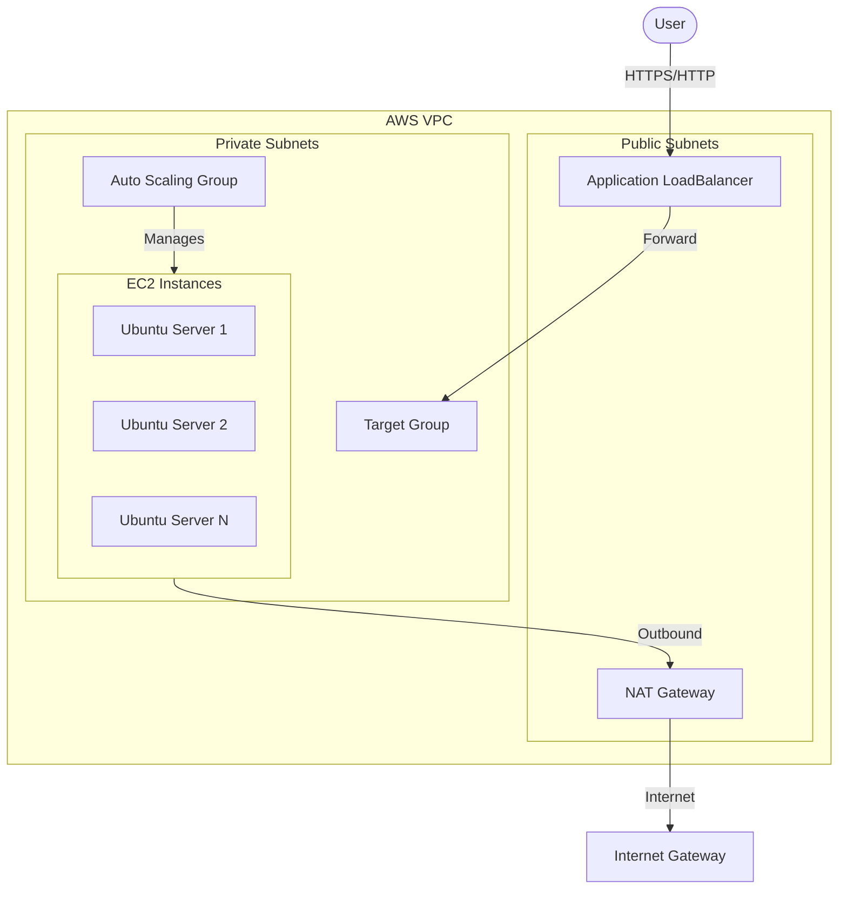

# AWS Scalable Web Infrastructure

A production-ready, modular Terraform project for deploying a highly available, scalable, and secure web hosting infrastructure on AWS.

## 🏗️ Architecture



## ✨ Features

- **Modular Design**: Separate modules for VPC, Security, IAM, ALB, and ASG.
- **High Availability**: Multi-AZ deployment (spanning 2 Availability Zones by default).
- **Security First**: 
  - Instances in **Private Subnets** (No direct internet access).
  - Least Privilege Security Groups.
  - SSM Session Manager access (No SSH keys required).
  - Encrypted EBS Volumes.
- **Cost Optimized**: 
  - **Single NAT Gateway** mode for non-prod environments.
  - **Spot Instance** support.
  - **Traffic Profiles** for easy right-sizing.
- **Modern Stack**: Ubuntu 22.04 LTS, Apache Web Server.

## 🚀 Quick Start

### Prerequisites
- [Terraform](https://developer.hashicorp.com/terraform/downloads) (v1.0+)
- [AWS CLI](https://aws.amazon.com/cli/) (Configured with `aws configure`)

### 1. Initialize
Clone the repository and initialize Terraform:
```bash
git clone <repo-url>
cd aws-scalable-web-infra
terraform init
```

### 2. Configure
Create your variables file:
```bash
cp terraform.tfvars.example terraform.tfvars
```
Edit `terraform.tfvars` to customize your settings.

### 3. Deploy
Review the plan and apply:
```bash
terraform plan
terraform apply
```

## ⚙️ Configuration

### Scaling Profiles (`traffic_type`)
Control the size of your fleet with a single variable.

| Profile | Min | Max | Desired | Use Case |
| :--- | :---: | :---: | :---: | :--- |
| `low` | 1 | 3 | 1 | Dev / Cost Saving |
| `medium` | 2 | 6 | 2 | Standard Production |
| `high` | 5 | 20 | 5 | High Traffic / Launch |
| `custom` | *Var* | *Var* | *Var* | Use `asg_*` variables |

### Key Variables

| Variable | Description | Default |
| :--- | :--- | :--- |
| `single_nat_gateway` | `true` for 1 NAT (Dev), `false` for HA (Prod) | `false` |
| `enable_spot_instances` | Use Spot Instances to save up to 90% cost | `false` |
| `certificate_arn` | ACM ARN for HTTPS support on ALB | `""` |
| `instance_type` | EC2 Instance Type | `t3.micro` |

## 🧪 Validation & Testing

### Scenario A: High Traffic (HTTP Load)
Best for testing actual request scaling. Use `traffic_type="high"` (Min 5).

1.  **Run the Load Generator**:
    ```powershell
    .\load-test.ps1
    ```
2.  **Observe**: This script sends concurrent requests to the ALB. CloudWatch metrics (`RequestCountPerTarget`) will rise, triggering the ASG to scale out.

### Scenario B: Low Traffic (CPU Stress)
Best for verification without high network cost. Use `traffic_type="low"` (Min 1).

1.  **Trigger CPU Stress via SSM**:
    ```bash
    aws ssm send-command --document-name "AWS-RunShellScript" \
      --targets "Key=tag:aws:autoscaling:groupName,Values=dev-asg" \
      --parameters commands=["stress --cpu 4 --timeout 300"]
    ```
2.  **Observe**: CPU utilization hits 100%. The ASG will scale from 1 to 3 instances within ~3 minutes.

## 🧹 Cleanup
To remove all resources and avoid costs:
```bash
terraform destroy
```

## 📂 Project Structure

```
├── modules/
│   ├── vpc/       # Network (VPC, Subnets, NAT, Routes)
│   ├── alb/       # Application Load Balancer
│   ├── asg/       # Launch Templates & Auto Scaling
│   ├── security/  # Security Groups
│   └── iam/       # IAM Roles for SSM
├── main.tf        # Root module (Assembly)
├── variables.tf   # Variable definitions
├── outputs.tf     # Outputs (ALB DNS, VPC ID)
└── load-test.ps1  # Validation script
```
