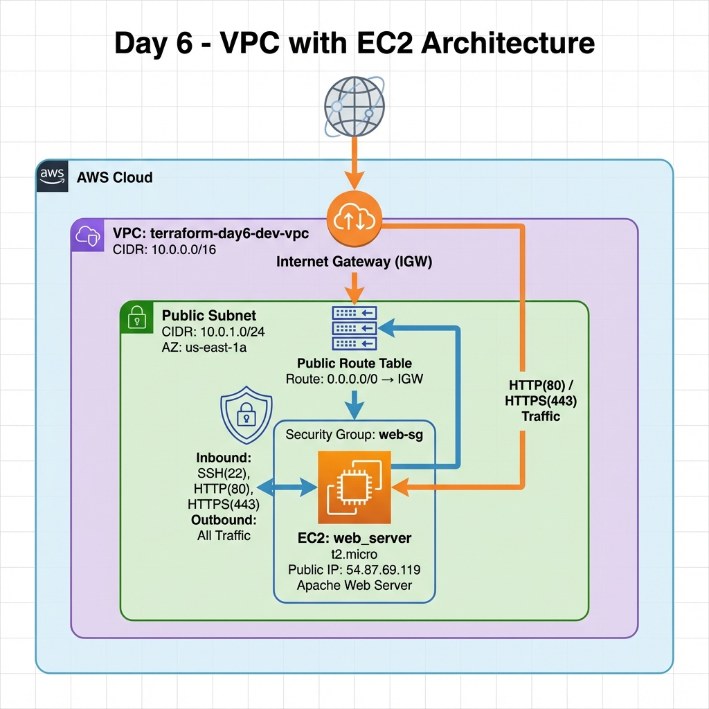
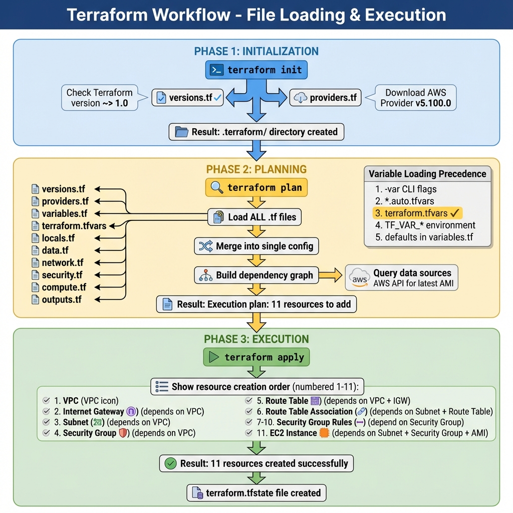

# Terraform Day 6 - VPC with EC2 Instance

## 📚 Learning Objectives

This project demonstrates **modern Terraform file organization** and **best practices** for structuring infrastructure code.

### Key Concepts Covered:
- ✅ Terraform file organization patterns
- ✅ Sequence of file loading in Terraform
- ✅ Best practices for file structure
- ✅ Code organization patterns
- ✅ VPC networking fundamentals
- ✅ Security group configuration
- ✅ EC2 instance deployment

---

## 🏗️ Architecture

This project creates a complete AWS infrastructure:

```
VPC (10.0.0.0/16)
├── Public Subnet (10.0.1.0/24)
│   ├── Internet Gateway
│   ├── Route Table (routes to IGW)
│   └── EC2 Instance
│       ├── Security Group (SSH, HTTP, HTTPS)
│       └── Apache Web Server
```

### Visual Diagrams

**Infrastructure Architecture Diagram:**



**Terraform Workflow Diagram:**



---

## 📂 File Structure

### Core Configuration Files
| File | Purpose | Loading Order |
|------|---------|---------------|
| `versions.tf` | Version constraints | Read during `terraform init` |
| `providers.tf` | AWS provider configuration | Read during `terraform init` |
| `variables.tf` | Input variable declarations | Early in plan/apply |
| `terraform.tfvars` | Variable value assignments | Auto-loaded during plan/apply |
| `locals.tf` | Computed local values | Evaluated during plan/apply |
| `data.tf` | Data source queries | Queried during plan/apply |

### Resource Files (by Category)
| File | Purpose | Resources Defined |
|------|---------|-------------------|
| `network.tf` | Networking resources | VPC, Subnets, IGW, Route Tables |
| `security.tf` | Security configuration | Security Groups, Rules |
| `compute.tf` | Compute resources | EC2 Instances |
| `outputs.tf` | Output values | Infrastructure info exports |

### Documentation
| File | Purpose |
|------|---------|
| `main.tf` | Explains modern file organization |
| `README.md` | Project documentation (this file) |

---

## 🚀 Quick Start

### Prerequisites
- Terraform installed (>= 1.0)
- AWS CLI configured with credentials
- Basic understanding of AWS VPC and EC2

### Deployment Steps

1. **Initialize Terraform**
   ```bash
   terraform init
   ```
   Downloads AWS provider and initializes backend.

2. **Format Code (Optional)**
   ```bash
   terraform fmt
   ```
   Formats all `.tf` files to canonical format.

3. **Validate Configuration**
   ```bash
   terraform validate
   ```
   Checks for syntax errors and configuration issues.

4. **Preview Changes**
   ```bash
   terraform plan
   ```
   Shows what Terraform will create/modify/destroy.

5. **Apply Configuration**
   ```bash
   terraform apply
   ```
   Creates the infrastructure. Type `yes` to confirm.

6. **View Outputs**
   ```bash
   terraform output
   ```
   Displays important information like instance IP and URLs.

7. **Access Web Server**
   ```bash
   # Get the URL
   terraform output web_server_url
   
   # Open in browser or curl
   curl $(terraform output -raw web_server_url)
   ```

8. **Destroy Infrastructure (When Done)**
   ```bash
   terraform destroy
   ```
   Deletes all resources. Type `yes` to confirm.

---

## 🔧 Configuration

### Variables You Can Customize

Edit `terraform.tfvars` to change these values:

```hcl
# AWS Region
aws_region = "us-east-1"

# Environment (dev, staging, prod)
environment = "dev"

# VPC CIDR Block
vpc_cidr = "10.0.0.0/16"

# Instance Type
instance_type = "t2.micro"  # Free tier eligible

# Security - SSH Access
allowed_ssh_cidr = ["YOUR_IP/32"]  # Restrict SSH to your IP!
```

### Important Security Setting

⚠️ **WARNING**: By default, SSH is open to the world (`0.0.0.0/0`). 

**For production, restrict SSH access:**
```hcl
allowed_ssh_cidr = ["203.0.113.42/32"]  # Your IP only
```

---

## 📖 File Loading Sequence

### How Terraform Processes Files

1. **Initialization Phase** (`terraform init`)
   - Reads `versions.tf` for version constraints
   - Reads `providers.tf` for provider configuration
   - Downloads required providers

2. **Planning/Apply Phase** (`terraform plan/apply`)
   - Loads **ALL** `.tf` files in the directory
   - Merges them into a single configuration
   - Builds dependency graph (not based on file order!)
   - Executes in dependency order

3. **Variable Resolution Precedence** (highest to lowest)
   - `-var` command-line flags
   - `*.auto.tfvars` files (alphabetical)
   - `terraform.tfvars` file
   - `TF_VAR_` environment variables
   - Default values in `variables.tf`

### Key Insights

- **File names don't matter to Terraform** - it merges all `.tf` files
- **File order doesn't matter** - Terraform builds a dependency graph
- **Dependencies are automatic** - No need to manually order resources
- **Best practice**: Organize files for human readability, not Terraform

---

## 📝 Best Practices Demonstrated

### 1. Separation of Concerns
- ✅ Network resources in `network.tf`
- ✅ Security resources in `security.tf`
- ✅ Compute resources in `compute.tf`
- ✅ Configuration in dedicated files

### 2. Variable Management
- ✅ All variables declared in `variables.tf`
- ✅ All values in `terraform.tfvars`
- ✅ Validation rules on important variables
- ✅ Descriptive variable names and documentation

### 3. Resource Naming
- ✅ Consistent naming convention: `${project}-${environment}-${resource}`
- ✅ Meaningful tags on all resources
- ✅ Easy to identify resources in AWS Console

### 4. Security
- ✅ Security groups with specific rules
- ✅ Conditional rule creation based on variables
- ✅ Encrypted EBS volumes
- ✅ IMDSv2 enabled on EC2 instances

### 5. Documentation
- ✅ Extensive comments explaining WHY, not just WHAT
- ✅ Clear descriptions on all variables and outputs
- ✅ README with quick start guide

---

## 🎯 Learning Points

### File Organization Patterns

**Pattern 1: Monolithic** (Days 1-5)
- Everything in `main.tf`
- Good for: Learning, very small projects
- Cons: Hard to navigate, poor for teams

**Pattern 2: Resource Type Separation** (Day 6 - Current)
- Separate files by resource category
- Good for: Single environment, medium projects
- Pros: Clear organization, easy to navigate

**Pattern 3: Module-Based** (Future)
- Reusable modules in separate directories
- Good for: Multi-environment, large projects
- Pros: Highly reusable, testable, composable

---

## 🔍 Troubleshooting

### Instance Not Accessible?

1. **Check Security Group**
   ```bash
   terraform output security_group_id
   # Verify rules in AWS Console
   ```

2. **Check Public IP**
   ```bash
   terraform output instance_public_ip
   # Should show an IP address, not empty
   ```

3. **Check User Data Logs**
   ```bash
   ssh ec2-user@$(terraform output -raw instance_public_ip)
   cat /var/log/cloud-init-output.log
   ```

4. **Verify Route Table**
   - AWS Console → VPC → Route Tables
   - Ensure `0.0.0.0/0` routes to Internet Gateway

### Common Errors

- **"No valid credential sources found"**: Configure AWS CLI
- **"Error launching source instance"**: Check AWS quotas
- **"VPC already exists"**: Change `project_name` in tfvars

---

## 📊 Outputs Explained

After `terraform apply`, you'll see:

```
infrastructure_summary = {
  availability_zone = "us-east-1a"
  instance_id = "i-0123456789abcdef0"
  public_ip = "54.123.45.67"
  vpc_id = "vpc-0123456789abcdef0"
  web_url = "http://54.123.45.67"
}
```

- **web_url**: Open this in a browser to see your web server
- **instance_id**: Use for AWS CLI commands
- **vpc_id**: Reference for adding more resources

---

## 🧹 Cleanup

**Important**: Destroy resources to avoid AWS charges!

```bash
terraform destroy
```

This will delete:
- EC2 instance
- Security groups
- Subnets and route tables
- Internet gateway
- VPC

---

## 📚 Additional Resources

- [Terraform Documentation](https://www.terraform.io/docs)
- [AWS VPC Documentation](https://docs.aws.amazon.com/vpc/)
- [Terraform Best Practices](https://www.terraform-best-practices.com/)
- [AWS Free Tier](https://aws.amazon.com/free/)

---

## 💡 Next Steps

After mastering Day 6:
- Add a private subnet with NAT Gateway
- Create an Application Load Balancer
- Add Auto Scaling Group
- Implement remote state with S3 backend
- Convert to module-based architecture
- Add RDS database in private subnet

---

**Happy Learning! 🚀**
